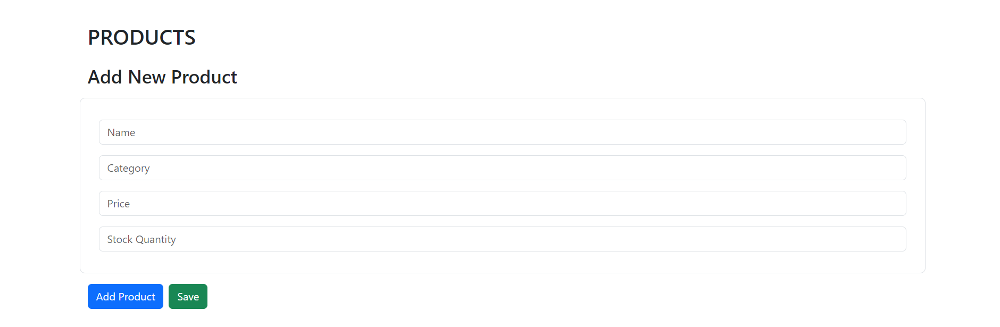

# ERP System with react

This repository contains the frontend code for the ERPSys application, a simple system for managing products and orders. The frontend is built using React.js and Bootstrap for styling.

### Installation

To run the ERPSys frontend on your local machine, follow these steps:

1. Clone the repository to your local machine:

```bash
git clone https://github.com/yogita-2708/ERP-System.git
```

2. Navigate to the project directory:

```bash
cd ERP-System
```

3. Install the dependencies:

```bash
npm install
```

### Usage

Once the installation is complete, you can start the development server:

```bash
npm start
```

This will start the development server and open the ERPSys application in your default web browser.

### Technologies Used

- React.js- The front-end of this application is built using React.js, a popular JavaScript library for building user interfaces.
- Bootstrap-  Bootstrap is utilized for responsive design, ensuring optimal viewing experience across devices.

### Features

#### Dashboard

The dashboard displays key metrics such as the total number of products and orders. It also provides links to navigate to the products and orders pages.

#### Products Page

The products page allows users to view, add, edit, and delete products. Each product is displayed in a table with options to edit or delete it.

#### Orders Page

The orders page displays a list of orders with details such as order ID, customer name, order date, and status. Users can view order details, update the order status, and delete orders. Additionally, a calendar view is also available.

### Screenshots


Utilize the navigation bar located at the top of the page to seamlessly switch between distinct sections of the application, including Dashboard, Products, and Orders.

The Dashboard page provides an overview of product and order information.

In Products page, you can view, add, edit, and delete products.

You can add products by clicking on the "Add Product" button, fill the required fields, and click "Save".

To edit a product, click on the "Edit" button next to the product you want to edit. Update the information and click "Save".

In Orders page, you can view order details, update order status, and delete orders.

You can view details of each order by clicking on the "View Details" button. And after viewing, you can close the details by clicking on "Close Details".


You can update the status of an order to "Shipped" by clicking the "Ship" button.
